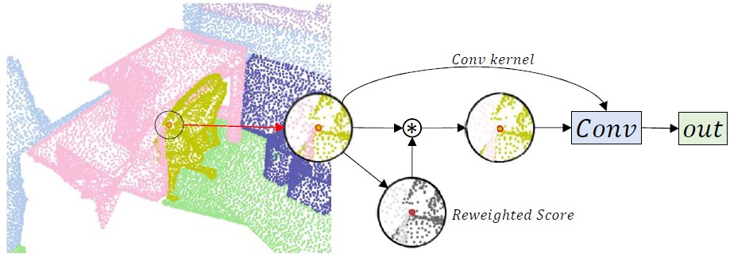

# PointConvFormer
*Wenxuan Wu, Qi Shan, Li Fuxin*

This is the PyTorch implementation of our paper [**PointConvFormer**]
<div align="center">
    
</div>

## Introduction

We introduce PointConvFormer, a novel building block for point cloud based deep neural network architectures. PointConvFormer combines ideas from point convolution, where filter weights are only based on relative position, and Transformers where the attention computation takes the features into account. In our proposed new operation, feature difference between points in the neighborhood serves as an indicator to re-weight the convolutional weights. Hence, we preserved some of the translation-invariance of the convolution operation whereas taken attention into account to choose the relevant points for convolution. We also explore multi-head mechanisms as well. To validate the effectiveness of PointConvFormer, we experiment on both semantic segmentation and scene flow estimation tasks on point clouds with multiple datasets including ScanNet, SemanticKitti, FlyingThings3D and KITTI. Our results show that %the deep network built with PointConvFormer substantially outperforms classic convolutions, regular transformers, and voxelized sparse convolution approaches with smaller, more computationally efficient networks.

## Highlight
1. We introduce PointConvFormer which modifies convolution by an attention weight computed from the  differences of local neighbourhood features. We further extend the PointConvFormer with a multi-head mechanism.
2. We conduct thorough experiments on semantic segmentation tasks for both indoor and outdoor scenes, as well as  scene flow estimation from 3D point clouds on multiple datasets. Extensive ablation studies are conducted to study the properties and design choice of PointConvFormer.

## Installation

### Environment
1. Install dependencies

```
pip install -U ipdb scikit-learn matplotlib open3d easydict
conda install pytorch==1.8.0 torchvision==0.9.0 torchaudio==0.8.0 cudatoolkit=10.1 -c pytorch
pip install tensorboard timm termcolor tensorboardX
```

2. Compile cpp_wrappers

```
cd cpp_wrappers/
sh compile_wrappers.sh
cd ..
```

### Data Preparation

#### ScanNetV2

1. Please download the [ScanNetV2](http://www.scan-net.org/) dataset.

2. Split the dataset file with `data_preparation/split_data_label_ply.py`. Please change the `split` and `data_path` accordingly.

3. Preprocess the dataset with `data_preperation/prepare_data.py`. Please change the `basepath` accordingly.

### Training

1. Before training, please setup the `train_data_path` and `val_data_path` in `configWenxuanPCFDDPL5WarmUP.yaml`;

2. You might also want to set the `model_name`, `experiment_dir` accordingly in `configWenxuanPCFDDPL5WarmUP.yaml`;

3. If you use turibolt and would like to save the results to blobby, Please set the `save_to_blobby` to `True`, and `use_tensorboard` to `False` in `configWenxuanPCFDDPL5WarmUP.yaml`;

4. Change other settings in `configWenxuanPCFDDPL5WarmUP.yaml` based on your experiments;

5. To train a model with `n` gpus, change the `num_gpus` and `devices_ids` accordingly in `configWenxuanPCFDDPL5WarmUP.yaml`. Change the `--nproc_per_node` to be `n` in `run_distributed.sh`.

6. ```sh run_distributedsh```

### Evaluation


